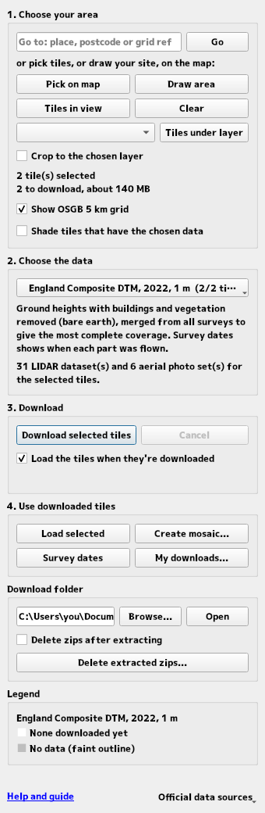
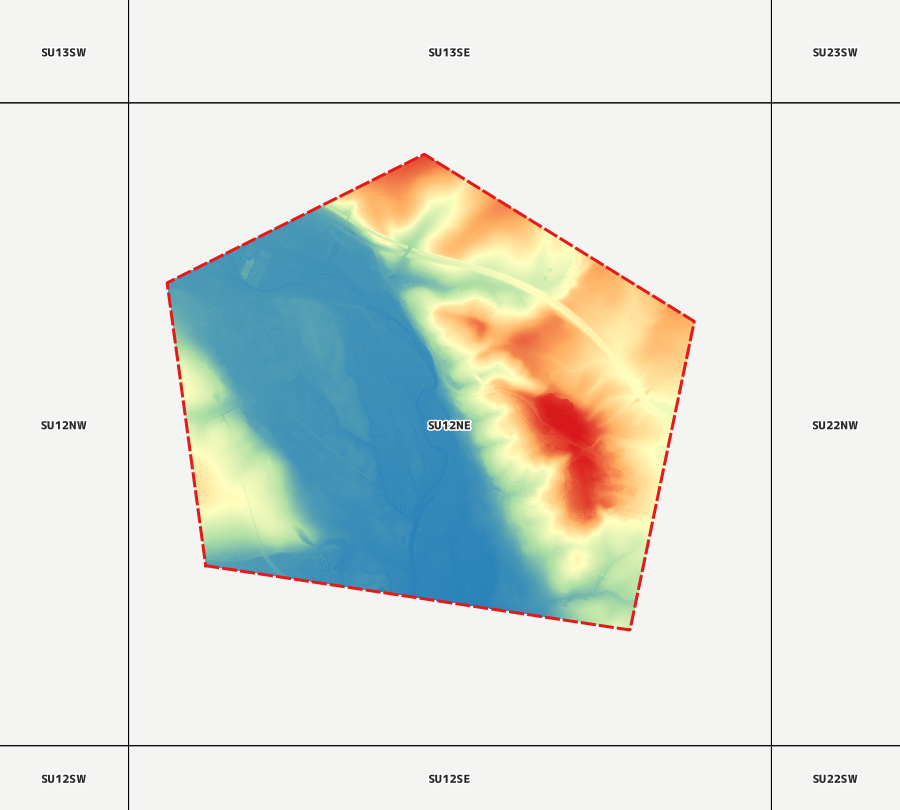
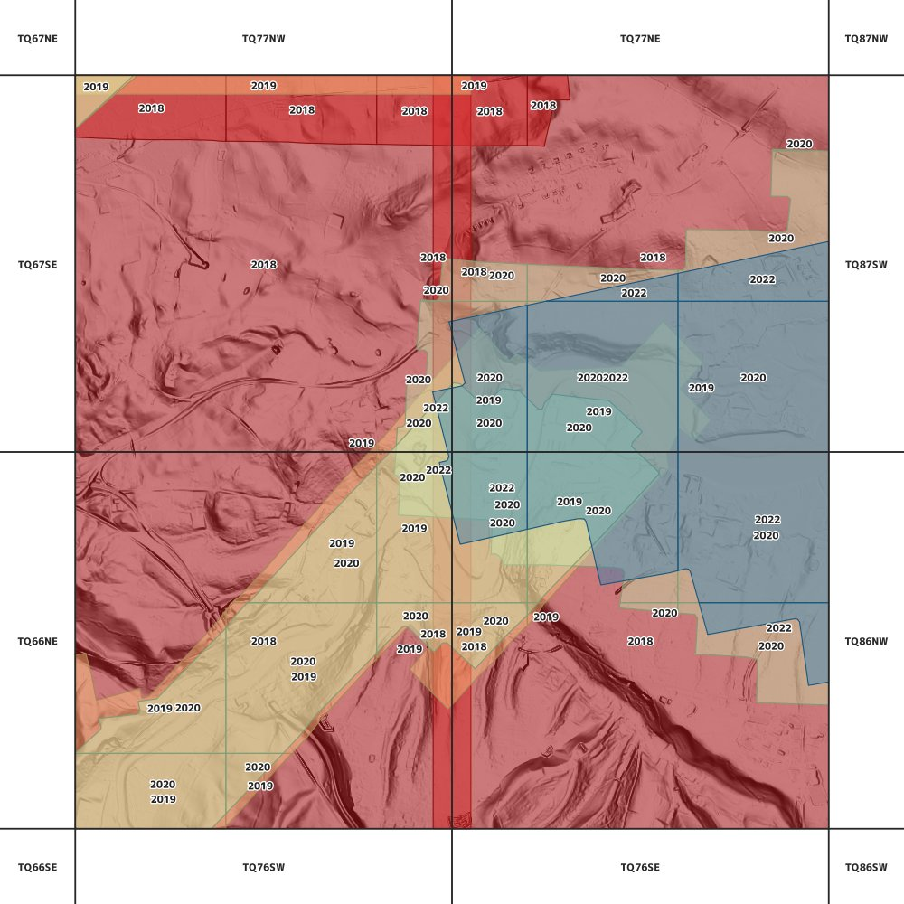
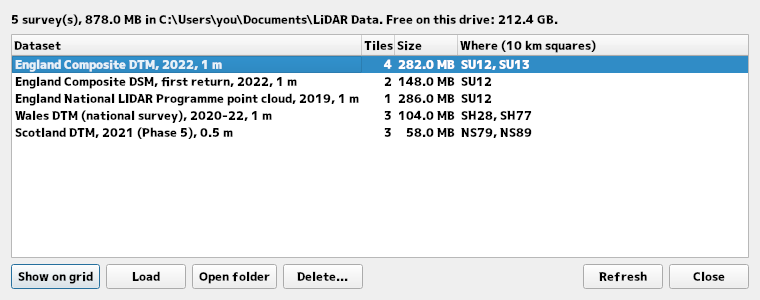

# LIDAR Downloader UK (QGIS plugin)

Download LIDAR data for **England, Wales and Scotland** straight into QGIS:

- **England** (Environment Agency): DTMs, DSMs, vegetation height, intensity and point clouds, from the 2022 Composite products and the National LIDAR Programme back to single surveys from 1998, plus river bathymetry, the coastal SurfZone DEM and, where flown, aerial photography.
- **Wales** (DataMapWales, Welsh Government / Natural Resources Wales): the 2020-22 national survey DTM/DSM at 1 m, and the NRW archive of surveys from 1998 to 2015.
- **Scotland** (Scottish Remote Sensing Portal, Scottish Government): the Phase 1-6 national LIDAR DTMs/DSMs and point clouds, and the other surveys the portal publishes (Outer Hebrides, Orkney, the national LIDAR programme and Historic Environment Scotland's surveys).
- **Northern Ireland**: not downloadable through the plugin yet. Its LIDAR is published as area downloads in Irish Grid, so the plugin points you to the official sources instead (**Official data sources** menu, and a notice when you go to or view Northern Ireland).

Choose your area on the map (go to a place, postcode or grid reference, pick 5 km OSGB grid tiles, or draw your site), choose the data, and the plugin finds, downloads, organises and loads it: one seamless mosaic per dataset, cropped to your site if you like, so a single click can download and crop in one go. It keeps your downloads in order (one folder per survey, with what's on disk and how much space it takes) and shows when each area was actually flown. Data comes straight from each government's official service (see [Data sources and licences](#data-sources-and-licences)), mostly under the Open Government Licence.

The plugin does one thing, getting the data, and aims to do it well. What you do with the data next (styling, terrain and contour exports, catchments) is for QGIS's own tools, or a companion plugin in the making.

Works on **QGIS 3.22+ (Qt5)** and **QGIS 4.x (Qt6)**.

## Getting started



1. Install the plugin (see [Installing](#installing)) and open it: **Web → LIDAR Downloader UK**, or the toolbar icon. A panel opens on the right, and the 5 km OSGB grid the data comes in appears on the map.
2. **Choose your area**: type a place, postcode or grid reference into **Go to** and press Enter. The map zooms there and the tiles covering it are selected. To take just your site, click **Draw area** and drag a rectangle around it (or click the corners of a polygon).
3. **Choose the data**: the menu lists what's available for your tiles. *England Composite DTM, 2022, 1 m* (bare ground, the most complete coverage) is a good start in England; in Wales and Scotland the plugin switches to their own DTM for you.
4. **Download selected tiles**. When they're downloaded they load as one seamless mosaic, coloured by height, and cropped to the area you drew.
5. **Create mosaic...** saves the result as a file (a VRT, or a GeoTIFF copy) for other software; **Survey dates** shows when the ground was flown.

Everything also runs from the **Processing Toolbox** (models and batch jobs). The sections below describe each part in detail.
<br clear="right">

## Usage

**Web → LIDAR Downloader UK → LIDAR Downloader UK** (or the toolbar icon) opens the panel and shows the OSGB 5 km grid. The panel works from top to bottom.

### 1. Choose your area

The grid squares are labelled with their tile names when zoomed in (closer than 1:500,000). Tiles you've downloaded are shaded (see the **Legend** at the bottom of the panel), and squares with no data from any of the sources (most of them sea, or Northern Ireland) have only a faint outline. Select tiles with any QGIS selection tool, or use:

- **Go to**: type an OS grid reference (`SU`, `SU12`, `SU 14 27`, `SU 14567 27890`, a tile such as `SU12NE`), an easting and northing (`414360, 130135`), a postcode or a place name, then press Enter. The map zooms there and the tiles covering it are added to the selection (unless there are more than 16: then pick the ones you want). Irish Grid references (`J 33 74`) and Northern Ireland postcodes and places (from OSNI's gazetteer, bundled) are recognised too, and show where to find Northern Ireland's data. Postcodes and places are looked up with [postcodes.io](https://postcodes.io) (Royal Mail and Ordnance Survey open data); grid references are worked out in the plugin.
- **Pick on map**: click a tile to add it to the selection (click again to remove it), or drag a box to add every tile under it. Works whatever layer is active.
- **Draw area**: drag a rectangle, or click the corners of a polygon (right-click or double-click to finish, Esc to start again). The tiles under the area are selected, and the area is kept as a temporary **Drawn area** layer to crop to (right-click it → **Make Permanent** to keep it).
- **Tiles in view**: the tiles with data covering the current map view.
- **Tiles under layer**: the tiles with data under the layer chosen beside it: its selected features if it has any, otherwise all its features, or its extent for rasters.
- **Crop to** (the chosen layer): crop what's loaded, and mosaics you save, to the layer's polygons (its selected features if it has any), such as your drawn area or a site boundary. Drawing an area ticks it; untick it to keep whole tiles.
- **Clear** clears the selection and removes the drawn area.



Under the buttons, the panel shows how many tiles are selected, how many there are to download and roughly how big they are, and how many you have already. Tick **Shade tiles that have the chosen data** to shade blue, as you pan and zoom, the tiles in view that have the chosen dataset but that you haven't downloaded yet. It works with up to 1,600 tiles in view (about 250 × 160 km on a wide screen); a note under the tick box says when to zoom in, while it's checking, and how many tiles it shaded.

Ticking **Show OSGB 5 km grid** always brings the grid to the top of the Layers panel.
<br clear="right">

### 2. Choose the data

The menu lists the datasets available for the selected tiles, named by nation and product: *England Composite DTM*, *Wales DTM (national survey)*, *Scotland DTM* and so on, with a sentence under it saying what the chosen one is. Each product opens its survey years and resolutions, with how many of the selected tiles each covers, e.g. *England DTM (individual surveys) ▸ 2012, 1 m (4/6 tiles)*; a product with only one survey is chosen straight from the menu. Where a product has several surveys, **newest for each tile** downloads each tile's newest survey at its finest resolution, and shows everything you've downloaded of that product, shaded in a different colour per survey (with a legend in the panel). The Composite 2022 datasets are always listed for tiles in England. A selection across a border lists each nation's datasets in its own submenu, and England's aerial photos in theirs.

If the chosen dataset covers none of the selected tiles but their nation has its own (say England's Composite DTM is chosen and you go to a place in Scotland), the plugin switches to that nation's DTM, DSM or point cloud and says so under the menu.

A few Scottish surveys (Historic Environment Scotland's, and the Phase 2 point clouds) are licensed for **non-commercial use only**: the menu marks them, and the plugin shows their terms and asks before downloading them.

### 3. Download

**Download selected tiles** downloads the chosen dataset for the selected tiles in the background, three tiles at a time, so you can keep working in QGIS. Progress shows in the panel and the QGIS task bar, and **Cancel** stops it. The plugin checks there's room on the drive first (allowing for zips extracting to about the same again), and asks before a large download or one with tiles you already have. Downloads use your QGIS network settings (proxy, authentication) and retry temporary server errors. If a service isn't answering at all, the plugin says so plainly, naming it, rather than failing tile by tile.

With **Load the tiles when they're downloaded** ticked (it is to start with), the tiles load as soon as they're in, cropped when **Crop to** is ticked: download and crop in one go. If a download is cancelled or partly fails, or QGIS closes before it finishes, **Resume: N tiles not downloaded yet** appears under the button: it selects those tiles again, in the same dataset and folder, and downloads what's missing.

Downloads are organised like the menu, one folder per survey:

```
<download folder>/lidar_composite_dtm/1m/2022/TQ74NE/TQ74ne_DTM_1m.tif
                  national_lidar_programme_dtm/1m/2020/SU12NW/...
                  lidar_point_cloud/2012/SU12NE/...        (no resolution level for point clouds and photos)
                  scotland_lidar_dtm/0.5m/2021-phase-5/NS79/NS79_DTM_50CM.tif   (a 10 km file, shared by its four tiles)
                  wales_lidar_dtm/1m/2020-2022/SH28SW/...                        (1 km GeoTIFFs)
```

Wales and Scotland publish some surveys as 1 km files and some as one file (or zip) per 10 km square. A 10 km file is downloaded once, into a folder named after the square, and used for each of the four 5 km tiles it covers. The Welsh archive surveys store heights in millimetres; the plugin converts them to metres, like everything else. Each downloaded grid gets overviews (smaller copies, in an `.ovr` file beside it), so a mosaic of many tiles draws quickly when you zoom out (this needs GDAL 3.4 or later, which recent QGIS installers include).

Typical sizes per 5 km tile: 1 m DTM/DSM about 70 MB in England and 36 MB for the Welsh 2020-22 survey, 2 m about 20 MB, and a National LIDAR Programme point cloud about 285 MB. Scotland's portal lists each file's size; the other figures are typical, so a survey that covers only part of a tile downloads less.

### 4. Use downloaded tiles

- **Load selected** adds the chosen dataset's downloaded tiles to the project, grouped under the dataset's name. Rasters and imagery load as **one seamless mosaic** per dataset (a small VRT in `<dataset folder>/mosaics/` that reads the tiles, so nothing is copied). Elevation (DTM / DSM) is coloured by height, stretched over the whole group; imagery has the black area outside the flight made transparent. Where surveys overlap (with **newest for each tile**), the newest is on top, at the finest cell size. Loading more tiles into a group rebuilds its mosaic, and files already in the project aren't loaded twice. With **Crop to** ticked, the mosaic is cropped to the layer's polygons; if the area misses the tiles, they load uncropped and the message says why.
- **Create mosaic...** saves the selected tiles as one file, loaded into the project: a **VRT** (a small file that reads the tiles, quick to make) or a **GeoTIFF** copy (Cloud-Optimised; standalone, to share or use in other software; made in the background), cropped when **Crop to** is ticked. For point clouds it saves a **virtual point cloud** (`.vpc`), or cropped, a COPC point cloud.

  

- **Survey dates** shows when the ground was actually flown: England's Composite DTM/DSM are merged from many surveys, and each tile's download lists them. The layer has one area per survey, coloured and labelled by year; with map tips on (**View → Show Map Tips**) hovering shows the survey and the dates it was flown.
- **My downloads...** lists everything in the download folder (see [Download folder](#download-folder)).

**Where the data comes from:** each layer's metadata (**Layer Properties → Metadata**) records the dataset, what it is, its source's copyright statement and licence, ready for attribution in print layouts and reports. Elevation layers (DTM/DSM) are set up for the **Elevation Profile** tool (QGIS 3.26 and later). If the map isn't in British National Grid (EPSG:27700), the coordinate system of the data, the plugin offers once to switch it.
<br clear="right">

### Download folder

The first time, downloads go to `Documents/LiDAR Data`, which the plugin makes for you. Change it here at any time (**Open** shows it in File Explorer). If the folder you chose isn't there (a drive not connected, say), the plugin says so and uses `Documents/LiDAR Data` in the meantime.

Tick **Delete zips after extracting** to roughly halve disk use. Tiles are still recognised as downloaded without their zip. **Delete extracted zips...** removes zips already in the folder, but only those whose tiles are fully extracted (every file present at the right size). Nothing happens until you confirm a warning listing the folder, each zip and its size, and any zips that will be kept. Zips are permanently deleted (not moved to the Recycle Bin); tiles can always be downloaded again.

Downloads made by earlier versions (an `extracted` folder, or folders like `..._2009_0.2m`) are moved into the current layout the first time the plugin opens the folder, after asking. Files are only renamed within the folder, never copied or deleted; VRT files in the folder and layers in the open project are updated to the new locations. Other saved projects that use the moved files will need their layer paths updating (QGIS offers this when it opens a project with missing files).



**My downloads...** lists every survey in the download folder, with its tiles, where they are (their 10 km squares; hover to see the tiles) and the space they take, and the space left on the drive. Pick one to **Show on grid** (chooses the dataset and selects its tiles), **Load** it, **Open folder**, or **Delete...** it: that permanently deletes the survey's folder (tiles, zips, and the mosaics and point cloud indexes made from them), after a warning saying how much, and which layers in the project use it (they're removed from the project first).

### Other data

**SurfZone DEM** (*England SurfZone DEM* in the menu, around the coast): one 2 m surface running from the land out across the nearshore sea bed, merging LIDAR with boat surveys (heights above Ordnance Datum). **Survey dates** shows which survey, and which kind (LIDAR, multibeam...), each part comes from.

**River bathymetry** (*England river bathymetry* in the menu, where rivers have been surveyed, e.g. stretches of the Thames): river-bed heights (metres above Ordnance Datum) surveyed by boat with multibeam sonar, as 0.5 m grids covering just the river channel. LIDAR can't see through water, so over rivers the DTM shows the water surface. The grids come without a coordinate system, so the plugin adds British National Grid when extracting them.

**Point clouds** (England's National LIDAR Programme and individual surveys, and Scotland's surveys; QGIS 3.32 or later with PDAL, which the standard installers include):

- **Load selected** shows the tiles in a dataset's group as **one virtual point cloud** (a `.vpc` index in `<dataset folder>/mosaics/`, so nothing is copied), coloured by classification: ground, vegetation, buildings, water. Loading more tiles extends it. Many Environment Agency surveys record no coordinate system, so the plugin treats them as British National Grid. Point clouds load whole; use **Create mosaic...** to save a cropped copy.
- A 5 km tile can be large: the 2017 London survey of TQ16NW is 700 MB (25 files of 1 km). On QGIS older than 3.32 each file loads as its own layer.

**Aerial photography** (England, listed after the LIDAR datasets where flights exist):

- *Vertical* orthophotos (RGB, RGBN, IRRGB false-colour infrared, night-time; 10 cm to 1 m) come as ECW files, typically 10-200 MB per tile depending on how much of it the flight covered. They load as a mosaic with the black area outside the flight made transparent. ECW needs QGIS's ECW support, which the standard Windows installers include.
- *Oblique* incident-response photos are angled JPEGs with GPS positions. **Load selected** turns them into a point layer: arrows show the camera direction, and hovering with map tips on (**View → Show Map Tips**) shows the photo.

**Official data sources** (at the foot of the panel) opens each source's own portal: the Environment Agency's survey data, DataMapWales and the Scottish Remote Sensing Portal, and for Northern Ireland, OpenDataNI's LIDAR and OSNI DTM datasets, Flood Maps NI and the GSNI GeoIndex.

Results show in the QGIS message bar. Details, such as which tiles failed and why, are in **View → Panels → Log Messages → LIDAR Downloader UK**.

## Processing Toolbox

**Processing → Toolbox → LIDAR Downloader UK → Download LIDAR / aerial tiles** does the same job without the panel, so it works in **models**, **batch mode** and **scripts**:

- **Area:** a layer (tick *Selected features only* to use a selection) and/or an extent. The tiles with data intersecting it are used, up to 300. England, Wales and Scotland are searched as needed; if one service is down, the others' tiles still download and the log says which failed.
- **Dataset:** product, survey year (`latest` = each tile's newest survey; for named surveys type the year as the panel's menu shows it, e.g. `2020-22` or `2011 (Phase 1)`, or just `2011`) and resolution in metres (`1`, `0.5`, `50cm`...; blank = finest available). The Product list is in the menu's order: England, then Wales, then Scotland, then England's aerial photos.
- **Licence terms:** a few Scottish surveys are for non-commercial use only; the tool stops and shows their terms unless *Accept the licence terms...* is ticked.
- **Download folder:** the panel's, to start with. Same layout as the panel, so tiles already downloaded by either are reused (tick *Download again* to refresh them).
- **Build a VRT mosaic** (rasters and imagery). The VRT is added to the project when the algorithm finishes. Left blank, it's saved in the dataset's folder, named after the dataset and the tiles, so each row of a batch run gets its own. Tick **Crop the VRT to the input layer's polygons** to download and crop in one go.
- **Clipped to the input layer** (optional): a standalone GeoTIFF copy of the tiles cut to the input layer's polygons.

From the Python console:

```python
result = processing.run("lidardownloader:downloadtiles", {
    "INPUT": iface.activeLayer(),        # or "EXTENT": "xmin,xmax,ymin,ymax [EPSG:27700]"
    "PRODUCT": 3,                        # index in the Product list: 3 = England National LIDAR Programme DTM
    "YEAR": "latest",
    "RESOLUTION": "",                    # finest available
    "FOLDER": r"C:\Users\me\Documents\LiDAR Data",
    "BUILD_VRT": True,
    "OUTPUT_VRT": r"C:\temp\site_dtm.vrt",
    "CROP_VRT": True,                    # cropped to the input layer's polygons
})
print(result["DOWNLOADED"], result["FAILED"], result["UNAVAILABLE"], result["OUTPUT_VRT"])
```

## Installing

*Upgrading from "LIDAR Downloader" (before 0.11)?* The plugin was renamed LIDAR Downloader UK and now installs as a separate plugin: uninstall the old one in **Plugins → Manage and Install Plugins**. Your settings and downloads carry over.

Download `lidar_downloader_uk-vX.Y.Z.zip` from the [latest release](https://github.com/simonstoate/LidarDownloaderUK/releases/latest), then use **Plugins → Manage and Install Plugins → Install from ZIP**.

### From source

Copy (or symlink) the `lidar_downloader_uk/` folder into your QGIS profile's plugin folder:

| QGIS | Windows plugin folder |
|---|---|
| 3.x | `%APPDATA%\QGIS\QGIS3\profiles\default\python\plugins\` |
| 4.x | `%APPDATA%\QGIS\QGIS4\profiles\default\python\plugins\` |

Then enable it in **Plugins → Manage and Install Plugins**.

## Development

Contributions are welcome: [CONTRIBUTING.md](CONTRIBUTING.md) explains how to report a bug, suggest a feature or send code.

```
lidar_downloader_uk/       the plugin (this folder is what gets zipped)
  lidar_downloader.py      plugin entry point: panel, buttons, messages
  lidar_downloader_dialog.py, lidar_downloader_dialog_base.ui   the panel's layout
  processing_provider.py   Processing Toolbox algorithm (Download LIDAR / aerial tiles)
  tasks.py                 background QgsTasks: availability search and downloads
  grid.py                  OSGB grid layer: load, style, selection
  maptools.py              "Pick on map" and "Draw area" map tools
  places.py                grid references, postcode and place lookups (no QGIS imports)
  pointclouds.py           virtual point clouds and cropping (PDAL)
  downloads_dialog.py      the "My downloads" window
  api.py                   products, datasets, Defra search/download API, tile maths (no QGIS imports)
  sources.py               Wales (DataMapWales WFS), Scotland (Remote Sensing Portal API), NI links (no QGIS imports)
  storage.py               download folder layout, zip extraction (no QGIS imports)
  migrate.py               moves downloads from earlier folder layouts (no QGIS imports)
  postprocess.py           GDAL: mosaics (VRT, cropped VRT, GeoTIFF copy), overviews, unit conversion, survey dates
  styles.py                elevation colours and the survey dates style
  .flake8                  flake8 settings for the code scan on plugins.qgis.org (the repository's are in setup.cfg)
tests/                     unit tests (pytest) + QGIS smoke test
tools/build_grid.py        rebuilds data/osgb_grid_5km.gpkg: OS grid + where any source has data (run with QGIS Python)
CHANGELOG.md               every release (metadata.txt carries those since the first public release, 0.14.3)
```

Every source file starts with its licence as an [SPDX](https://spdx.dev/learn/handling-license-info/) line (GPL-2.0-or-later) and a docstring saying what the module is for; lines are at most 120 characters.

Unit tests, lint and the security scans that plugins.qgis.org runs on every upload (Bandit and detect-secrets, which
block publication if they find anything) don't need QGIS:

```
pip install pytest flake8 bandit detect-secrets
python -m pytest
flake8 lidar_downloader_uk tests tools
bandit -r lidar_downloader_uk
detect-secrets scan lidar_downloader_uk
```

The smoke test runs the whole plugin headless inside QGIS, with a faked network:

```
"C:\Program Files\QGIS 4.2.1\bin\python-qgis.bat" "<repo>\tests\smoke_test_qgis.py"
```

Set `LIDAR_LIVE=1` to add one real ~70 MB download.

GitHub Actions runs lint and unit tests, plus the smoke test in the `qgis/qgis` Docker images for **3.22, 3.34, 3.40 and 3.44 (Qt5)** and **4.2 (Qt6)**, on every push. To release, add the release to `CHANGELOG.md` and to `metadata.txt` (`version` and `changelog`), then push a matching tag (e.g. `v0.14.3`). The release workflow builds the plugin zip and attaches it to a GitHub release.

Compatibility rules for supporting both Qt5 and Qt6:

- Import Qt only through `qgis.PyQt`, never `PyQt5`/`PyQt6` directly.
- Use fully scoped enums, e.g. `Qt.DockWidgetArea.RightDockWidgetArea` and `QMessageBox.StandardButton.Yes`.
- Use `exec()`, not `exec_()`.
- If a download service changes, update `lidar_downloader_uk/api.py` (England) or `lidar_downloader_uk/sources.py` (Wales, Scotland) only.
- Load icons by file path. There are no compiled `resources.py` files, because `pyrcc` doesn't exist for Qt6.
- Code in `tasks.py` `run()` runs on a worker thread: no widgets or project access there.

## Data sources and licences

- **England** (LIDAR, river bathymetry, SurfZone DEM, aerial photography) is downloaded from the Environment Agency's [Survey Data Download](https://environment.data.gov.uk/survey) service: © Environment Agency copyright and/or database right, under the [Open Government Licence v3.0](https://www.nationalarchives.gov.uk/doc/open-government-licence/version/3/).
- **Wales** is downloaded from [DataMapWales](https://datamap.gov.wales/) (Welsh Government's 2020-22 national survey; Natural Resources Wales' archive), under the Open Government Licence v3.0. Welsh Government notes the data wasn't created specifically for flood modelling.
- **Scotland** is downloaded from the [Scottish Remote Sensing Portal](https://remotesensingdata.gov.scot/) (Scottish Government and partners). Most surveys are under the Open Government Licence v3.0; some (Historic Environment Scotland's surveys, the Phase 2 point clouds) are for non-commercial use only, and the plugin asks before downloading those.
- **Northern Ireland**'s LIDAR isn't downloaded by the plugin; the **Official data sources** menu links to it on [OpenDataNI](https://www.opendatani.gov.uk/dataset?tags=LIDAR). Place names for Northern Ireland come from OSNI's gazetteer (bundled; Open Government Licence v3.0).

  The plugin records each survey's source and licence in the loaded layer's metadata; please acknowledge it in maps and reports.
- **The OSGB 5 km grid** bundled with the plugin (`lidar_downloader_uk/data/osgb_grid_5km.gpkg`: every square of the British National Grid, sea included) is Ordnance Survey's [osbng-grids](https://github.com/OrdnanceSurvey/osbng-grids): contains OS data © Crown copyright and database right, under the Open Government Licence v3.0. Its `HAS_DATA` flag (whether any of the sources had data for the square) was added from the three services by `tools/build_grid.py`, which can be re-run to refresh it. It's only used for shading and the "tiles in view / under layer" helpers: what each tile has is always checked with the service when you select it. See `lidar_downloader_uk/data/LICENSE-DATA.txt`.
- **Place and postcode search** sends the text you type to [postcodes.io](https://postcodes.io) (Royal Mail and Ordnance Survey open data). Grid references are worked out in the plugin and not sent anywhere. Nothing else leaves your computer apart from the searches and downloads on the England, Wales and Scotland services.

Tested on Windows (QGIS 4.2) and Linux (QGIS 3.22, 3.34, 3.40, 3.44 and 4.2 in CI); it should work on macOS but hasn't been tried there, so please report any problems.

## About

I've worked in flood risk, drainage and natural flood management for more than twenty years, and I'm passionate about putting the growing amount of open data to practical use. I built this plugin with AI assistance, to make the UK's open LIDAR quick to find, download and use in QGIS. I hope you find it useful, and I'd love to hear what you think.

**Simon Stoate**

## Licence

Copyright (C) 2025-2026 Simon Stoate. GPL-2.0-or-later. See [LICENSE](LICENSE).
